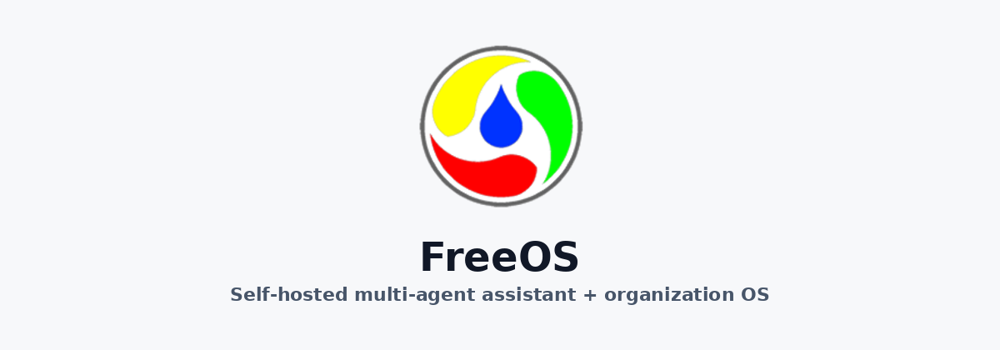

<p align="center">
  
</p>

<p align="center">
  <strong>FreeOS — a self-hosted multi-agent OS that grows its own AI workforce.</strong>
</p>

<p align="center">
  <a href="https://www.python.org/downloads/"></a>
  <a href="LICENSE"></a>
</p>

<p align="center">
  <a href="#run-the-self-growth-loop">The loop</a> ·
  <a href="#run-freeos">Run</a> ·
  <a href="#license-and-attribution">License</a> ·
  <a href="docs/architecture-integration.md">Architecture</a>
</p>

**FreeOS** is an independent open-source host. The data plane is derived from [Octop](https://github.com/TencentCloud/Octop) (MIT). The organization control plane comes from [openXYOS](https://github.com/XYAIStudio/openXYOS) (Apache-2.0). They are complementary: FreeOS **produces** AI employees, skills, plugins, and MCPs; those assets **assemble into openXYOS**; openXYOS blueprints, catalog, policies, and talent **feed back** into FreeOS to spawn or upgrade more runtime agents.

The web shell, README banner, favicons, and PWA icons use the FreeOS circular mark (gray ring, yellow / green / red teardrops, blue center).

## Run the self-growth loop

This is the product path. One command compiles a blueprint into an AI employee, promotes it `draft → market → recruit → shadow → active`, registers a FreeOS chat agent, publishes an asset pack, applies that pack onto openXYOS-shaped surfaces (live HTTP when `OPENXYOS_BASE_URL` is set, otherwise a durable local mirror), imports the control plane back, and proves governance still **blocks** high-risk tools.

```bash
git clone https://github.com/XYAIStudio/FreeOS.git
cd FreeOS
uv sync
uv run freeos org loop run
```

Equivalent: `bash scripts/org-loop.sh`.

CI / scripted proof of the same loop:

```bash
uv run pytest tests/e2e/test_org_growth_loop.py tests/unit/test_org_loop.py tests/unit/test_openxyos_apply.py tests/unit/test_colleague_spawn.py tests/unit/test_host_governance.py
```

| When | What happens |
|---|---|
| `OPENXYOS_BASE_URL` unset / sidecar down | Uses `tests/fixtures/org-loop/` and writes `{FREEOS_HOME}/openxyos-mirror/` |
| `OPENXYOS_BASE_URL` (or `FREEOS_ORG_SIDECAR_URL`) set | Also POST/PUT `/api/employees`, `/api/talent`, `/api/plugins`, `/api/module-settings` |

High-risk tools (`outbound`, `delete`, `pay`, `prod`) are default-denied in the host tool path (`OrgGovernanceMiddleware` + `xyos-governance-mcp`). `execute` stays false until `freeos org governance approve <id>` and the agent re-checks with the same args.

Operator detail: [docs/asset-loop.md](docs/asset-loop.md).

## Run FreeOS

### Prerequisites

- Python 3.12+ (the project uses [uv](https://docs.astral.sh/uv/))
- Node.js 20.19+ only if you start the organization sidecar or rebuild the dashboard

### From this repository

```bash
uv run freeos init
uv run freeos run
```

`freeos` is the product CLI. `octop` remains a package-compatible alias.

Open the dashboard (default listen port is printed by `run`, commonly `http://127.0.0.1:18900`). Complete the first-run wizard.

Data directory precedence:

1. `FREEOS_HOME`
2. `OCTOP_HOME` (legacy)
3. existing `~/.freeos`
4. existing `~/.octop`
5. new installs → `~/.freeos`

### Rebuild the dashboard (optional)

```bash
cd dashboard
npm install
npm run build
```

The Vite app in `dashboard/` is what you edit; packaged builds land in `src/octop/dashboard/`.

### Tests

```bash
uv run pytest tests/e2e/test_org_growth_loop.py tests/unit/test_org_loop.py tests/unit/test_org_module.py tests/unit/test_governance_mcp.py tests/unit/test_skill_bridge.py tests/unit/test_blueprint_compiler.py tests/unit/test_lifecycle.py tests/unit/test_asset_loop.py tests/unit/test_openxyos_apply.py tests/unit/test_colleague_spawn.py tests/unit/test_host_governance.py
```

Full host suite: `uv run pytest` / `make test-fast` (needs the usual extra services for marked tests).

## Enable the organization module

The host stays Python. openXYOS stays a TypeScript sidecar under `modules/openxyos/`. Toggle it from any of:

| Surface | Action |
|---|---|
| Dashboard | Sidebar → **Organization** → enable switch |
| CLI | `uv run freeos org enable` · `uv run freeos org status` |
| Plugin | Admin → Plugins → **Organization OS** (`org-os`) |
| API | `PATCH /api/org-module` with `{ "enabled": true }` |

Then start the sidecar (Node 20+):

```bash
bash scripts/run-org-sidecar.sh
```

Default origin: `http://127.0.0.1:3780` (`FREEOS_ORG_SIDECAR_URL` / `OPENXYOS_BASE_URL` / `FREEOS_ORG_SIDECAR_PORT` to override). When `/api/health/livez` succeeds, `/organization` embeds the org console and `/api/org-module/sidecar/*` proxies to it.

**Auth:** FreeOS JWT users and openXYOS tenants are separate. The proxy forwards `X-FreeOS-User*` and `X-FreeOS-Tenant-Id`. One tenant = one workspace/sandbox — not prompt isolation.

### Manual loop steps (the one command above already does this)

```bash
uv run freeos org enable
uv run freeos org governance enable --tenant-id 1
uv run freeos org assets import --catalog --blueprint tests/fixtures/org-loop/agent-blueprint.v1.json --tenant-id 1
uv run freeos org employee transition policy-analyst market
uv run freeos org employee transition policy-analyst recruit
uv run freeos org employee transition policy-analyst shadow
uv run freeos org employee transition policy-analyst active
uv run freeos org assets publish
uv run freeos org assets apply
```

Inbound import compiles the blueprint **and** registers a FreeOS agent (`org-policy-analyst`) so the colleague is addressable in chat. Governance is spliced into the host tool path — a pending/deny decision is a hard stop.

## Host platform features (from Octop)

Unchanged in this fork: multi-user JWT, multi-agent chat, expert library, connectors, ACP, knowledge bases, bundled plugins, cron, terminal/browser/desktop surfaces. Upstream-oriented installers and desktop artifacts still refer to **Octop** and `~/.octop/` — use `freeos` / `FREEOS_HOME` here.

Longer host docs: [docs/user-guide.md](docs/user-guide.md), [docs/configuration.md](docs/configuration.md), [docs/architecture.md](docs/architecture.md), [README_CN.md](README_CN.md).

## License and attribution

| Component | License | Location |
|---|---|---|
| FreeOS host + bridge | MIT | [LICENSE](LICENSE), [NOTICE](NOTICE) |
| Octop-derived code | MIT | Copyright Octop contributors; no Tencent Cloud affiliation claimed |
| openXYOS tree | Apache-2.0 | [modules/openxyos/LICENSE](modules/openxyos/LICENSE), [licenses/APACHE-2.0.txt](licenses/APACHE-2.0.txt) |

## Remaining `octop` identifiers

Intentional for package compatibility (not a rebrand miss):

- Python package name `octop` and `import octop`
- CLI `octop` alongside `freeos`
- `OCTOP_*` environment variables
- SQLite file `octop.db` inside the home directory

See [docs/architecture-integration.md](docs/architecture-integration.md) for the control/data-plane split and the running self-growth loop.
