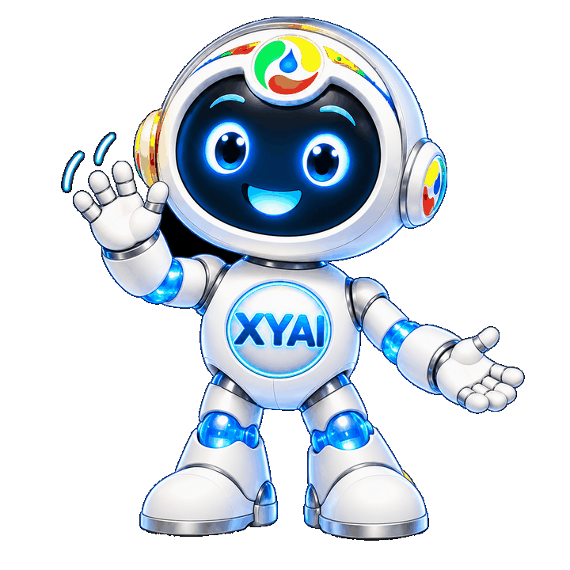
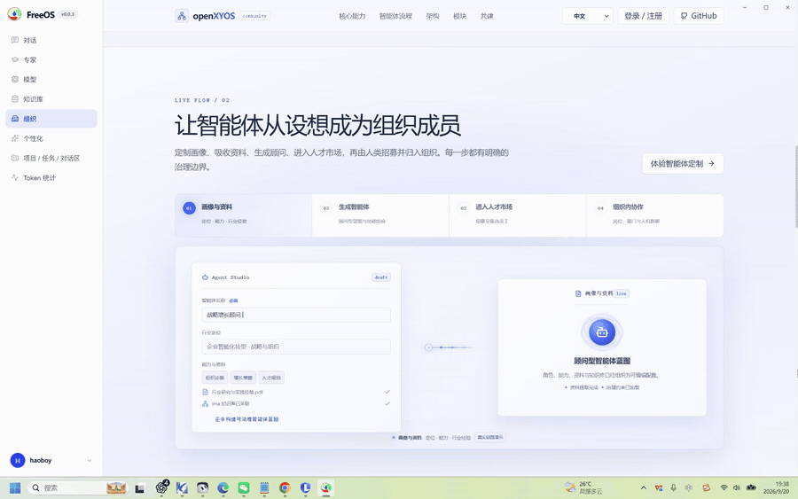
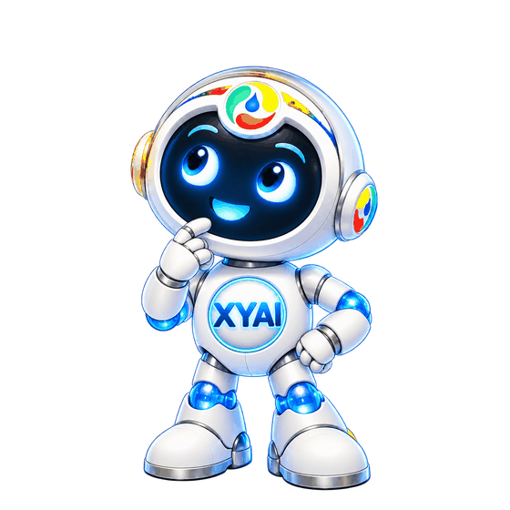

<p align="center">
  
</p>

<p align="center">
  <strong>Your FreeOS, free for you.</strong>
</p>

<p align="center">
  <a href="https://www.python.org/downloads/"></a>
  <a href="https://github.com/XYAIStudio/FreeOS/releases"></a>
  <a href="LICENSE"></a>
  <a href="https://github.com/TencentCloud/Octop"></a>
  <a href="https://github.com/XYAIStudio/openXYOS"></a>
</p>

<p align="center">
  <a href="#product-vision">Vision</a> ·
  <a href="#feature-preview">Features</a> ·
  <a href="#run-the-self-growth-loop">The loop</a> ·
  <a href="#run-freeos">Run</a> ·
  <a href="#developer-community">Community</a> ·
  <a href="#license-and-attribution">License</a> ·
  <a href="docs/product-contract.md">Product contract</a> ·
  <a href="docs/architecture-integration.md">Architecture</a>
</p>

<p align="center">
  <strong>Languages:</strong>
  <a href="README.zh-CN.md">简体中文</a> ·
  <a href="README.zh-TW.md">繁體中文</a> ·
  <a href="README.ja.md">日本語</a> ·
  <a href="README.ko.md">한국어</a> ·
  <a href="README.fr.md">Français</a> ·
  <a href="README.es.md">Español</a> ·
  <a href="README.ru.md">Русский</a>
</p>

**FreeOS** is an independent open-source host. The data plane is derived from [Octop](https://github.com/TencentCloud/Octop) (MIT). The organization control plane comes from [openXYOS](https://github.com/XYAIStudio/openXYOS) (Apache-2.0). They are complementary: FreeOS **produces** experts / assistants (not yet in a department), skills, plugins, and MCPs; those assets **assemble into openXYOS** as department employees; openXYOS blueprints, catalog, policies, and talent **feed back** into FreeOS as colleagues.

## Product vision

Chinese original (authoritative wording): [README.zh-CN.md](README.zh-CN.md) · [product-contract.zh-CN.md](docs/product-contract.zh-CN.md).

FreeOS was created for a simple, clear purpose: on top of Octop’s self-hosted multi-agent capabilities, anyone should be able to have the power of **both** Octop and openXYOS — without choosing between “chat and automation” and “organization and governance.”

We want models to run locally when possible, and knowledge to stay local. Existing Octop and openXYOS capabilities and assets should interoperate and strengthen each other. On that base, users can develop, refine, and customize — grow a new openXYOS that fits their own setting — and export its system source for further productization and commercialization.

To avoid the install cost and size of shipping a full embedded openXYOS tree, FreeOS takes another path: gradually turn openXYOS web and organization capabilities into **native** capabilities on the Octop host, forming one unified system — FreeOS. The managed Node process and embedded organization page in the current desktop build are a **bridge** to that end state, not the destination.

In how you use it, FreeOS is more like a studio of your own: settle in locally first, with signup, login, data, and sessions staying within reach; links to broader services or licensing can open later as options, never as a gate at the start. Organization capabilities are like another room in that studio you can arrange on its own — for trying, rehearsing, and growing your own org workflows — sharing one FreeOS with everyday chat and assistants, yet leaving each use its own space so the two ways in don’t collapse into one.

In one line: **FreeOS = a locally controlled Octop base + growable, exportable organization capabilities; two systems in one, two identities kept apart.**

Canonical contract: [docs/product-contract.md](docs/product-contract.md) · [中文](docs/product-contract.zh-CN.md).

**Non-goals for the next increments:** do not freeze bundled Node or the embedded organization page as the architecture; do not collapse everyday studio use and the organization room into one way in; do not make broader services or licensing a gate at the start. Asset bus, export rewrite, Node removal, and migration maps are later work (P0.2+), not this freeze.

## Feature preview

<table>
  <tr>
    <td width="68%">
      <h3>From industry knowledge to a system you own</h3>
      <p>Bring your experience, roles and source materials into a governed organization workflow. FreeOS is built to help users create, validate and export a system that fits their own scenario.</p>
    </td>
    <td align="center" valign="bottom"></td>
  </tr>
</table>

<p align="center">
  
</p>

The workflow animation is captured from the openXYOS Agent Studio included in this repository: define a profile and materials, generate a governed assistant blueprint, then bring it into the organization.

<p align="center">
  
</p>

The web shell, README banner, favicons, and PWA icons use the FreeOS circular mark (gray ring, yellow / green / red teardrops, blue center).

## Upstream attribution and project positioning

<p>
  <a href="https://github.com/TencentCloud/Octop"></a>
  <a href="https://github.com/XYAIStudio/openXYOS"></a>
</p>

FreeOS is an independent downstream project, not an official Octop release. It preserves the applicable copyright notices and licenses for its upstream components:

- [Octop](https://github.com/TencentCloud/Octop) provides the MIT-licensed host foundation: the multi-agent runtime, FastAPI control plane, dashboard, desktop packaging, and compatibility identifiers.
- [openXYOS](https://github.com/XYAIStudio/openXYOS) provides the Apache-2.0 organization module foundation: the organization model, blueprints, governance contracts, and local customization workspace.
- FreeOS adds its own integration bridge, local-first product flow, release packaging, governance and export capabilities. It does not claim endorsement, certification, sponsorship, or trademark rights from Octop or Tencent Cloud.

For the exact license split, notices and trademark-safe wording, see [NOTICE](NOTICE), [upstream attribution](docs/upstream-attribution.md), and [the integration architecture](docs/architecture-integration.md).

## Run the self-growth loop

This is the product path. One command compiles a blueprint into a colleague, promotes it `draft → market → recruit → shadow → active`, registers a FreeOS chat agent, publishes an asset pack, applies that pack onto openXYOS-shaped surfaces as department employees (live HTTP when a managed runtime / `OPENXYOS_BASE_URL` / `org-os/runtime.json` is present, otherwise a durable local mirror), imports the control plane back, and proves governance still **blocks** high-risk tools.

```bash
git clone https://github.com/XYAIStudio/FreeOS.git
cd FreeOS
uv sync
uv run freeos org loop run
```

Equivalent: `bash scripts/org-loop.sh`.

CI / scripted proof of the same loop:

```bash
uv run pytest tests/e2e/test_org_growth_loop.py tests/unit/test_org_loop.py tests/unit/test_openxyos_apply.py tests/unit/test_colleague_spawn.py tests/unit/test_host_governance.py
```

| When | What happens |
|---|---|
| No runtime URL | Uses `tests/fixtures/org-loop/` and writes `{FREEOS_HOME}/openxyos-mirror/` (`remote_applied=false`; Node is not started) |
| Managed runtime, `OPENXYOS_BASE_URL`, `FREEOS_ORG_SIDECAR_URL`, or `{FREEOS_HOME}/org-os/runtime.json` | Also POST `/api/freeos/ingest` for the current org workspace tenant (`remote_applied=true`) |

High-risk tools (`outbound`, `delete`, `pay`, `prod`) are default-denied in the host tool path (`OrgGovernanceMiddleware` + `xyos-governance-mcp`). `execute` stays false until `freeos org governance approve <id>` and the agent re-checks with the same args.

Operator detail: [docs/asset-loop.md](docs/asset-loop.md).

## Run FreeOS

### Windows 用户：下载安装包 → 安装 → 打开即用 FreeOS（Octop壳+组织能力）

给非开发者的路径：

1. 打开 [GitHub Releases](https://github.com/XYAIStudio/FreeOS/releases/latest)，下载
   `FreeOS-desktop-windows-amd64-<version>.exe`（普通 64 位电脑）或
   `FreeOS-desktop-windows-arm64-<version>.exe`（ARM 电脑）。
2. 双击安装包。安装程序会放到「程序文件」并创建开始菜单和桌面快捷方式。
3. 打开 **FreeOS**。第一次启动会解压内置运行环境（可能要一两分钟），然后直接进入可用会话，无需先登录。
4. 保存、导出或发布到账号时再在本机完成注册或登录（更广的服务或授权不挡起步）。侧栏 **Organization** 当前默认走宿主内组织能力；桌面 0.0.3 托管 Node + iframe、以及可选的完整 openXYOS Node 栈（`127.0.0.1:3780`，导出/同步/高级部署）都是 **过渡桥**，终态是把 openXYOS 迁入宿主。组织能力像工作室里另一间可独立布置的房间，与日常对话、助手协作同在一个 FreeOS，两种进入方式不捏成一种。

数据目录默认是 `%USERPROFILE%\.freeos`（可用环境变量 `FREEOS_HOME` 改）。旧版 Octop 的 `~/.octop` 仍会被识别。卸载安装包会清空安装目录（默认为 `Program Files\FreeOS`）并删除快捷方式，但**不会**删除该用户数据目录；详见 [desktop/README.md](desktop/README.md#windows-uninstall)。

安装包由 CI 工作流 **FreeOS Desktop Package**（文件名仍是 `.github/workflows/octop-desktop.yml`，给现有发版脚本用）在 Windows runner 上打出来。本仓库的云环境打不出 `.exe`；合并后由该 job 产出。

### Prerequisites

- Python 3.12+ (the project uses [uv](https://docs.astral.sh/uv/))
- Node.js 20.19+ only if you opt into the organization sidecar (`FREEOS_ORG_SIDECAR=1`) from source, or rebuild the dashboard. A fresh FreeOS install does not need Node. The sidecar / iframe path is a [transition bridge](docs/product-contract.md), not the destination.

### From this repository

```bash
uv run freeos init
uv run freeos run
```

`freeos` is the product CLI. `octop` remains a package-compatible alias.

Open the dashboard (default listen port is printed by `run`, commonly `http://127.0.0.1:18900`). Complete the first-run wizard — **Ollama / a local OpenAI-compatible URL is the first choice**; cloud keys stay optional.

### Local models and knowledge bases

FreeOS prefers runtimes and files on this computer. Cloud vendors are optional.

| What | Where |
|---|---|
| Chat models | First-run wizard (Ollama selected first) or **Models → Local**: start Ollama, register GGUF, or add a local OpenAI-compatible URL (LM Studio, llama.cpp, vLLM). |
| Knowledge | Sidebar **Knowledge Bases**: mount a local folder first. Local ONNX embeddings are the default vector path. ima / WeKnora remain optional connectors. |
| Detail | [User guide](docs/user-guide.md#四配置模型llm-供应商) · [Configuration](docs/configuration.md#local-models-and-knowledge-bases) · [Product contract](docs/product-contract.md#local-models-and-knowledge-bases) |

Data directory precedence:

1. `FREEOS_HOME`
2. `OCTOP_HOME` (legacy)
3. existing `~/.freeos`
4. existing `~/.octop`
5. new installs → `~/.freeos`

### Rebuild the dashboard (optional)

```bash
cd dashboard
npm install
npm run build
```

The Vite app in `dashboard/` is what you edit; packaged builds land in `src/octop/dashboard/`.

### Tests

```bash
uv run pytest tests/e2e/test_org_growth_loop.py tests/unit/test_org_loop.py tests/unit/test_org_module.py tests/unit/test_governance_mcp.py tests/unit/test_skill_bridge.py tests/unit/test_blueprint_compiler.py tests/unit/test_lifecycle.py tests/unit/test_asset_loop.py tests/unit/test_openxyos_apply.py tests/unit/test_colleague_spawn.py tests/unit/test_host_governance.py
```

Full host suite: `uv run pytest` / `make test-fast` (needs the usual extra services for marked tests).

## Enable the organization module

The host stays Python. Organization first paint is the native dashboard page
plus `/api/org-module/*` (catalog, ingest/import, growth loop, employees).
The TypeScript sidecar under `modules/openxyos/` is an optional **transition bridge** (export/sync/unmigrated App surfaces), not the end-state runtime. See [docs/product-contract.md](docs/product-contract.md).

| Surface | Action |
|---|---|
| Dashboard | Sidebar → **Organization** (in-host workbench) |
| CLI | `uv run freeos org enable` · `uv run freeos org status` · `uv run freeos org loop run` |
| Plugin | Admin → Plugins → **Organization OS** (`org-os`) |
| API | `PATCH /api/org-module` with `{ "enabled": true }` |
| Standalone commercial site | `uv run freeos org export-standalone --out dist/openxyos-web` — default `--mode full` writes an openXYOS source tree plus host-bridge slice; see [docs/org-export.md](docs/org-export.md) |

Optional Node sidecar (export/sync/advanced deploy only):

```bash
FREEOS_ORG_SIDECAR=1 bash scripts/run-org-sidecar.sh
```

Default origin if opted in: `http://127.0.0.1:3780`. Organization and
`freeos org loop run` do **not** wait for `/api/health/livez`.

**Auth:** Settle in locally first. Organization capabilities are another room in the same studio — they share one FreeOS with everyday chat and assistants, and the two ways in don’t collapse into one. Broader services or licensing can open later as options, never as a gate at the start. The proxy still forwards `X-FreeOS-User*` and `X-FreeOS-Tenant-Id` for workspace/sandbox scoping (one tenant = one workspace/sandbox — not prompt isolation).

### Manual loop steps (the one command above already does this)

```bash
uv run freeos org enable
uv run freeos org governance enable --tenant-id 1
uv run freeos org assets import --catalog --blueprint tests/fixtures/org-loop/agent-blueprint.v1.json --tenant-id 1
uv run freeos org employee transition policy-analyst market
uv run freeos org employee transition policy-analyst recruit
uv run freeos org employee transition policy-analyst shadow
uv run freeos org employee transition policy-analyst active
uv run freeos org assets publish
uv run freeos org assets apply
```

Inbound import compiles the blueprint **and** registers a FreeOS agent (`org-policy-analyst`) so the colleague is addressable in chat. Governance is spliced into the host tool path — a pending/deny decision is a hard stop.

## Host platform features (from Octop)

Unchanged in this fork: multi-user JWT, multi-agent chat, expert library, connectors, ACP, knowledge bases, bundled plugins, cron, terminal/browser/desktop surfaces. The **Windows desktop installer** is branded **FreeOS** and defaults to `~/.freeos` / `FREEOS_HOME`. The Python package, `octop` CLI alias, `OCTOP_*` env vars, and `octop.db` stay for compatibility.

Longer host docs: [docs/user-guide.md](docs/user-guide.md), [docs/configuration.md](docs/configuration.md), [docs/architecture.md](docs/architecture.md), [README_CN.md](README_CN.md).

## Developer community

<table>
  <tr>
    <td align="center" width="42%"></td>
    <td align="center">
      <strong>XYAI Founders developer community</strong><br/><br/>
      Share organization designs, local-workspace practices, extensions and export feedback with other builders.<br/><br/>
      <br/>
      Scan to join. Please do not share API keys, tokens, or customer data in public discussions.
    </td>
  </tr>
</table>

You can also start a topic in [GitHub Discussions](https://github.com/XYAIStudio/FreeOS/discussions).

## License and attribution

| Component | License | Location |
|---|---|---|
| FreeOS host + bridge | MIT | [LICENSE](LICENSE), [NOTICE](NOTICE) |
| Octop-derived code | MIT | Copyright Octop contributors; no Tencent Cloud affiliation claimed |
| openXYOS tree | Apache-2.0 | [modules/openxyos/LICENSE](modules/openxyos/LICENSE), [licenses/APACHE-2.0.txt](licenses/APACHE-2.0.txt) |

## Remaining `octop` identifiers

Intentional for package compatibility (not a rebrand miss):

- Python package name `octop` and `import octop`
- CLI `octop` alongside `freeos`
- `OCTOP_*` environment variables (desktop also sets `FREEOS_HOME`)
- SQLite file `octop.db` inside the home directory
- CI workflow **filename** `.github/workflows/octop-desktop.yml` (display name is FreeOS Desktop Package)

See [docs/product-contract.md](docs/product-contract.md) for product intent, [docs/architecture-integration.md](docs/architecture-integration.md) for the control/data-plane split and the running self-growth loop, and [docs/org-capability-migration-map.md](docs/org-capability-migration-map.md) ([简体中文](docs/org-capability-migration-map.zh-CN.md)) for what is already native on the host vs still on managed Node / iframe (P0.2).

