# Octop 用户帮助文档

> **Historical vs Current.** 本文沿自 Octop 宿主操作说明（安装、向导、模型、对话）。**Current：** 产品是 [FreeOS](../README.zh-CN.md)；权威意图见 [产品契约](product-contract.zh-CN.md)。数据目录优先 `FREEOS_HOME` / `~/.freeos`（仍识别 `~/.octop`）。先在本机安顿好；组织能力像工作室里另一间可独立布置的房间。

> 本帮助文档面向最终用户，介绍 **安装 → 设置向导 → 配置模型 → 基本使用** 的完整流程。
> 所有运行时数据默认存放在 `~/.octop/`（可通过 `OCTOP_HOME` 覆盖）。

---

## 目录

- [一、简介](#一简介)
- [二、安装 Octop](#二安装-octop)
  - [2.1 环境要求](#21-环境要求)
  - [2.2 一键脚本安装（推荐）](#22-一键脚本安装推荐)
  - [2.3 验证安装](#23-验证安装)
  - [2.4 Docker 安装（生产推荐）](#24-docker-安装生产推荐)
- [三、首次启动与设置向导](#三首次启动与设置向导)
  - [3.1 启动服务](#31-启动服务)
  - [3.2 向导步骤说明](#32-向导步骤说明)
  - [3.3 无人值守 / 跳过向导](#33-无人值守--跳过向导)
- [四、配置模型（LLM 供应商）](#四配置模型llm-供应商)
  - [4.1 本机模型（推荐）](#41-本机模型推荐)
  - [4.2 本机 OpenAI 兼容端点](#42-本机-openai-兼容端点)
  - [4.3 云厂商与自定义供应商](#43-云厂商与自定义供应商)
  - [4.4 选择模型并测试连接](#44-选择模型并测试连接)
  - [4.5 在控制台中管理供应商](#45-在控制台中管理供应商)
  - [4.6 通过 CLI 配置供应商](#46-通过-cli-配置供应商)
  - [4.7 图片与视频生成模型](#47-图片与视频生成模型)
  - [4.8 知识库（本机优先）](#48-知识库本机优先)
- [五、基本使用](#五基本使用)
  - [5.1 登录](#51-登录)
  - [5.2 对话（Chat）](#52-对话chat)
  - [5.3 创建 Agent（专家库 / MBTI 人格）](#53-创建-agent专家库--mbti-人格)
  - [5.4 连接器（Connectors）](#54-连接器connectors)
  - [5.5 通道（Channels / IM）](#55-通道channels--im)
  - [5.6 定时任务（Cron）](#56-定时任务cron)
  - [5.7 ACP（与 IDE / 编码 Agent 协作）](#57-acp与-ide--编码-agent-协作)
  - [5.8 设置（用户 / 安全 / TLS / 系统）](#58-设置用户--安全--tls--系统)
  - [5.9 远程桌面与浏览器 AI](#59-远程桌面与浏览器-ai)
- [六、常用命令速查](#六常用命令速查)
- [七、常见问题](#七常见问题)
- [八、插图清单](#八插图清单)

---

## 一、简介

**Octop** 是一个开源、自托管的 AI 助手平台，支持多用户、多 Agent。它在单进程中同时提供 Web 控制台、CLI、IM 通道（飞书、钉钉、QQ、Discord、企业微信等）和定时任务，所有数据都保存在你自己的机器上。


核心特性速览：

- 👥 多用户多 Agent 专家团，可在家庭 / 团队内共享。
- 🎭 16 种 MBTI 人格模板，为每个 Agent 赋予鲜明性格。
- 🔒 本地优先、JWT 多用户隔离、工具审批与命令护栏。
- 🔌 Connector（OAuth + MCP）与专家库拓展能力边界。
- 🧠 可迁移记忆，随工作区一起保存。
- 🖥️ 远程桌面、浏览器 AI+、终端 AI+ 等富交互能力。

---

## 二、安装 Octop

### 2.1 环境要求

- 操作系统：**macOS / Linux / Windows**。
- **无需** 预先安装 Python —— 安装脚本会通过 [uv](https://docs.astral.sh/uv/) 在 `~/.octop/` 下自动创建隔离的 Python 3.12 虚拟环境。
- 需要可访问外网，用于下载安装脚本与依赖。

### 2.2 一键脚本安装（推荐）

**macOS / Linux**

```bash
curl -fsSL https://finnie-1258344699.cos.ap-guangzhou.myqcloud.com/octop/install.sh | bash
```

**Windows（PowerShell）**

```powershell
irm https://finnie-1258344699.cos.ap-guangzhou.myqcloud.com/octop/install.ps1 | iex
```

**Windows（cmd）** —— 先下载再运行：

```bat
curl -fsSL https://finnie-1258344699.cos.ap-guangzhou.myqcloud.com/octop/install.bat -o install.bat
install.bat
```

安装完成后，**打开一个新终端** 或重新加载 shell 配置，使 PATH 生效：

```bash
source ~/.zshrc   # Zsh
# 或
source ~/.bashrc  # Bash
```

安装脚本会把 `octop` 命令放入 `~/.octop/bin` 并加入 PATH，并在 `~/.octop/venv` 创建隔离环境；**不会改动系统 Python**。

> **可选附加组件**：安装脚本支持通过 `--extras` 追加能力，例如浏览器自动化 `--extras browser`、飞书通道 `--extras channels-feishu`；也可用 `--version` 指定版本、`--mirror <url>` 使用国内 PyPI 镜像。更多选项见 [scripts/README.md](scripts/README.md)。

### 2.3 验证安装

```bash
octop --version
octop run --help
```

若提示 `command not found: octop`，请确认已重新加载 shell 或检查 `~/.octop/bin` 是否在 PATH 中。

### 2.4 Docker 安装（生产推荐）

```bash
# 构建并后台启动
docker compose -f docker/docker-compose.yml up -d

# 或手动构建后运行
bash docker/docker_build.sh
docker run -d \
  -p 8088:8088 \
  -v octop-data:/data/.octop \
  -e HOME=/data \
  -e OCTOP_DEFAULT_PASSWORD="<自定义强密码，留空则自动生成随机密码>" \
  octop:latest
```

完整环境变量见 [.env.example](.env.example)：

| 变量 | 默认值 | 说明 |
|------|--------|------|
| `OCTOP_PORT` | `8088` | HTTP 监听端口 |
| `OCTOP_DEFAULT_PASSWORD` | _(空)_ | 首次运行管理员密码（Docker 引导；≥8 位且含字母+数字；留空则自动生成随机密码并写入 credential.txt） |
| `OCTOP_ADMIN_USERNAME` | `admin` | 首次运行管理员用户名 |
| `OCTOP_DATA` | `~/.octop` | 宿主机数据目录（compose 挂载） |

> 后续计划：Docker 首次启动可改为随机生成管理员密码，并仅写入 `credential.txt`。

---

## 三、首次启动与设置向导

### 3.1 启动服务

安装完成后，直接启动服务即可。首次运行时，控制面数据库、JWT 密钥与首个管理员都会在**设置向导**中创建（绿场默认延后打开数据库，直到向导里确认 SQLite / PostgreSQL）：

```bash
octop run       # 前台启动 API + Web 控制台
```

若希望服务在后台常驻，可注册为系统服务：

```bash
octop service start   # Linux(systemd) / macOS(launchd) / Windows 服务
```

启动后打开 **http://127.0.0.1:8088**。

首次访问会**自动跳转到设置向导页面**（URL 类似 `/setup`）。若启用了启动密码保护，向导会先要求输入一次性「设置密码」。

### 3.2 向导步骤说明

设置向导为分步引导，依次完成以下步骤（若关闭了 `require_setup_password`，则从「数据库」步开始）：

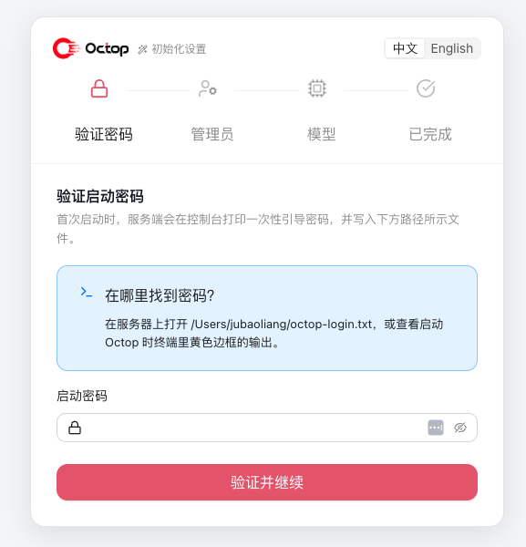

**步骤 1：设置密码（可选）**

- 首次配置需要一个临时「设置密码」作为保护（默认开启）。
- 密码打印在启动终端，并写入服务器上的引导文件（常见为 `~/octop-login.txt`）。
- 此步**不依赖**控制面数据库是否已打开。

**步骤 2：选择控制面数据库**

- 默认使用本地 **SQLite**（路径相对 `~/.octop/`，通常为 `octop.db`），点击「保存并继续」即可。
- 「展开更多」可配置 **PostgreSQL**（内测）：填写主机等并先「测试连接」，再「使用 PostgreSQL 并继续」。
- 向导会把选择写入 `config.json` 的 `database` 段，并在服务进程内**首次绑定**连接池、跑迁移。
- 也可事先用环境变量指定（见 [configuration.md](configuration.md) 的 `OCTOP_DATABASE_*`）；已有库文件的升级安装不会延后建连。
- 本步只配置**控制面**；若选用 PostgreSQL，Agent 记忆默认复用同一 DSN（可用 `memory.backend.type=sqlite` 强制文件记忆）。详见 [configuration.md](configuration.md)。

**步骤 3：创建管理员账号**

- 填写 **用户名**（默认 `admin`）、**密码**、**显示名称**。
- 密码须至少 8 位，且同时包含字母和数字（与控制台「修改密码」策略一致）。
- 该账号为首个管理员，拥有用户管理、系统设置等最高权限。
- 记下该账号，后续登录与日常使用都依赖它。

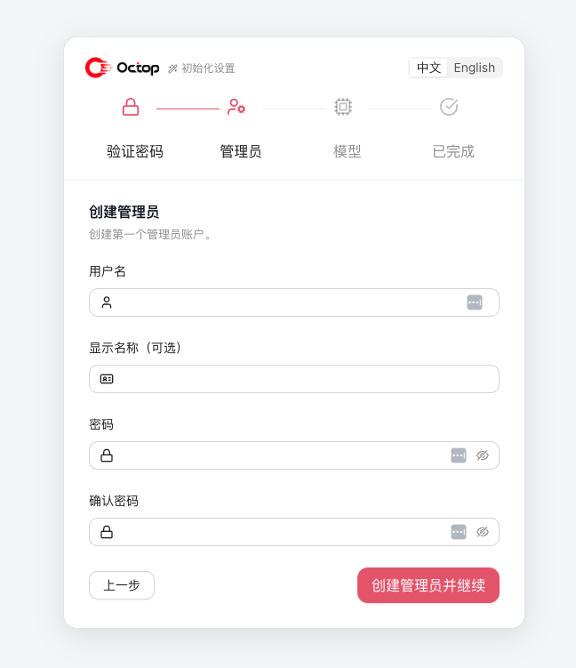

**步骤 4：配置模型（LLM 供应商）**

- 向导默认先选 **Ollama（本机）**。本机运行时已启动时可测连通性后继续；也可以先继续，稍后在「模型 → 本地」拉取模型。
- 云厂商卡片仍在「显示更多」里，需要时再填 API Key。
- 自定义供应商可填本机 OpenAI 兼容地址（LM Studio、llama.cpp、vLLM），本机地址不必填真实密钥。
- 该步骤可**跳过**（Skip），稍后在控制台「模型」中再配置。

详见下一节 [四、配置模型](#四配置模型llm-供应商)。

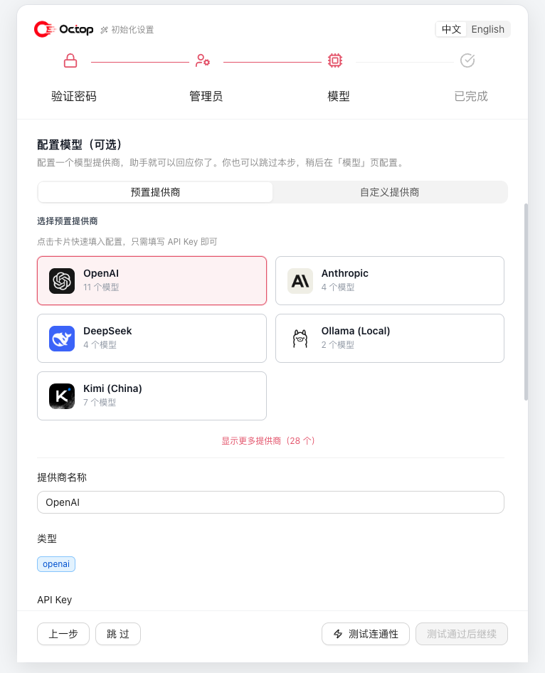

**步骤 5：完成**

- 向导写入配置、解锁完整 API，并自动以刚创建的管理员身份登录。
- 完成后进入 Web 控制台首页。

> **备份提示：** 系统备份按控制面引擎区分（SQLite 文件 vs `pg_dump`）。SQLite 与 PostgreSQL 的备份**不能跨引擎互恢**；恢复前运行时引擎须与备份一致。PostgreSQL 模式下主机需提供 `pg_dump` / `pg_restore`。

### 3.3 无人值守 / 跳过向导

对于自动化部署，可省略向导中的"设置密码"步骤，直接在 Web 控制台通过环境变量预设管理员身份后启动：

```bash
export OCTOP_ADMIN_USERNAME=admin
export OCTOP_ADMIN_PASSWORD="<你的强密码，≥8 位且含字母和数字>"
octop run
```

密码须满足策略（≥8 位，同时包含字母和数字）。之后再在 Web 控制台中完成模型等其余配置即可。

---

## 四、配置模型（LLM 供应商）

FreeOS 通过 **供应商（Provider）** 接入大模型。默认路径是本机运行时；云厂商是可选项。每个 Agent 可使用不同的供应商与模型。

### 4.1 本机模型（推荐）

在向导「模型」步骤或控制台 **模型 → 本地**：

1. 若已安装 Ollama，可一键启动（Windows 走已知安装路径）。未安装时，按页面提示用官方安装方式补齐。
2. 拉取或注册本机模型（Ollama tag，或扫描到的 GGUF / GGML）。
3. 「测速」确认本机响应；「设为默认」后，新对话优先使用它。
4. 本机 ONNX 出现在同一「本地」页，用于知识库向量，不用于对话。

Ollama 预设默认 `base_url` 为 `http://127.0.0.1:11434/v1`，无需云厂商 API Key。

### 4.2 本机 OpenAI 兼容端点

LM Studio、llama.cpp server、vLLM 等只要提供 OpenAI 兼容 `/v1`，即可在向导「自定义」或 **模型 → 自定义提供商** 里接入：

- **类型**：`openai`（OpenAI 兼容）
- **Base URL**：如 `http://127.0.0.1:1234/v1`（LM Studio）、`:8080/v1`（llama.cpp）
- **API Key**：本机地址可留空（会写入占位值）

### 4.3 云厂商与自定义供应商

需要云厂商时，在向导或 **模型 → 云端** 选择预设：

| 预设 | 说明 |
|------|------|
| OpenAI | 官方 API，需 API Key |
| Anthropic | Claude 系列，需 API Key |
| DeepSeek | 需 API Key |
| 智谱 Zhipu | 通义 / 智谱 GLM，需 API Key |
| Kimi | 月之暗面，需 API Key |

选择预设后会自动带出该供应商的默认 `base_url` 与内置模型列表。非本机自定义网关同样走「自定义」，并填写真实 API Key。

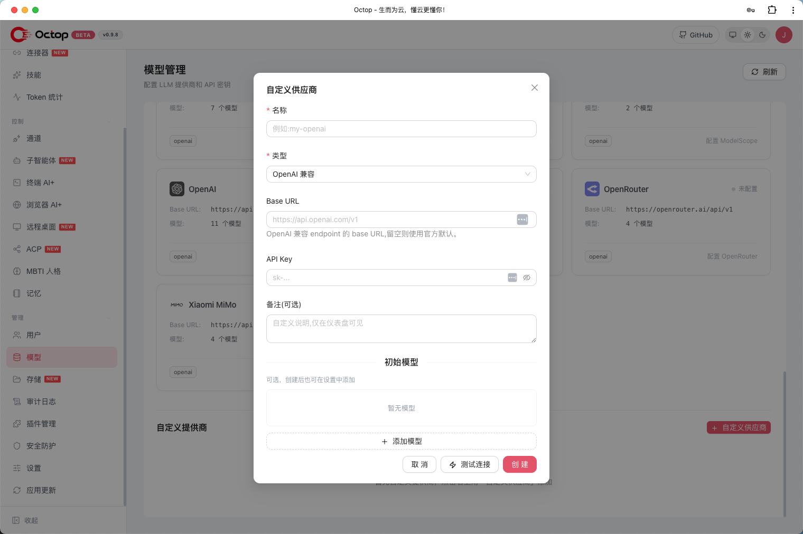

### 4.4 选择模型并测试连接

1. 在供应商下勾选要启用的模型（可全选 / 全不选）。本机 Ollama 若尚未拉取模型，可先继续，稍后再注册。
2. 云厂商需 **测试连接** 通过后再继续；本机路径可以先继续，运行时起来后再测。
3. 若测试失败，请检查本机端口（11434 / 1234 / 8080）、或云厂商的 API Key、Base URL 与配额。

### 4.5 在控制台中管理供应商

除首次向导外，日常可在 **模型** 页（默认打开「本地」标签）中：

- 查看本机硬件、启动 Ollama、注册 GGUF。
- 新增 / 编辑 / 删除云厂商或自定义供应商。
- 为一个供应商增删模型（含自定义模型 ID、上下文窗口、最大 Token、是否支持推理）。
- 为不同 Agent 指定默认供应商与模型。

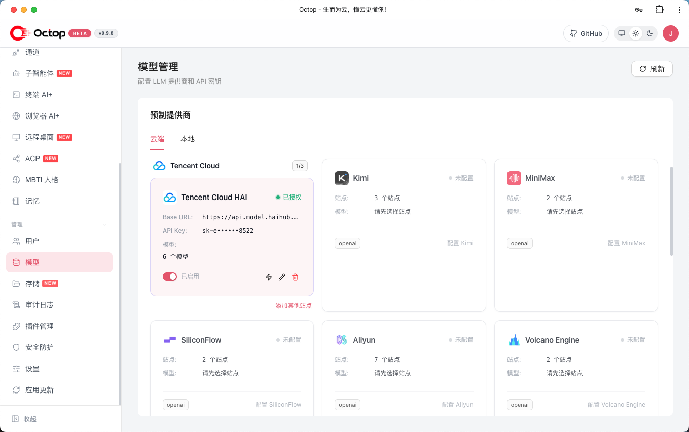

### 4.6 通过 CLI 配置供应商

```bash
octop models              # 查看供应商预设与模型解析（Ollama / ONNX 排在前面）
octop provider list       # 列出已配置供应商
octop provider --help     # 供应商增删改查帮助
octop models ollama-list  # 列出本机 Ollama 模型（需服务已启动）
```

### 4.7 图片与视频生成模型

具备云模型管理权限的用户可以打开 **设置 → 模型 → 生成模型**，为所有 Agent
配置火山方舟图片与视频生成能力：

1. 在[火山方舟控制台](https://console.volcengine.com/ark)开通所需的 Seedream、Seedance 模型。
2. 在 [API Key 管理](https://console.volcengine.com/ark/region:ark+cn-beijing/apikey)创建方舟 API Key。
3. 启用媒体生成，并分别选择或填写图片、视频模型 ID。
4. 先验证方舟凭证；需要时再执行图片或视频模型测试。
5. 保存配置。系统会加密保存 API Key，并自动重载运行中的 Agent。

> 模型测试会向火山方舟提交真实生成请求，可能产生少量费用。视频测试在任务创建成功后会立即请求取消。

### 4.8 知识库（本机优先）

侧栏 **知识库** 把文档做成对话可检索的资料。默认路径是这台电脑上的文件夹，不必先接云。

1. 桌面首次启动会打开知识库功能。空状态先引导 **挂接本机文件夹**（只读；解析结果写到你另选的目录）。
2. **基础设置** 里向量模型默认 **本机 ONNX**（需先下载模型；可选 `uv sync --extra local-embedding`）。在线 Embedding 是可选项。
3. ima / WeKnora 等云挂接是可选项，出现在本机卡片旁边并标为「可选」。
4. 组织房间的知识页列出的是同一套宿主知识库，不是第二套笔记库。

配置指针：[configuration.md](configuration.md#local-models-and-knowledge-bases)。

---

## 五、基本使用

### 5.1 登录

打开 **http://127.0.0.1:8088**。桌面或本机首次启动会先发一张工作室访客通行证，不必先填登录墙；需要保存、导出时再注册。远程安装则使用向导创建的账号登录。

桌面首启与再次打开：可选模型（云密钥或本机 Ollama，可跳过）→ 第一个智能体 `/chat/main`。不要停在 Octop `/projects` 工作台，也不要把组织页当第一屏。

组织能力像工作室里的另一间房间：侧栏「组织」走进去试用、布置流程。那间房间有自己的登记本，不会把房间里的管理员钥匙悄悄换成工作室大门的管理员钥匙。两种用法同在一个 FreeOS 里，各自留白。

> ⚠️ **安全提醒**：Docker 首次初始化若未设置 `OCTOP_DEFAULT_PASSWORD`，会自动生成随机管理员密码（写入 `/data/.octop/credential.txt`，可用 `docker exec <容器> cat /data/.octop/credential.txt` 查看）。无论哪种方式，都请尽快在 **个人设置 → 修改密码** 中更换，避免服务暴露到公网时被未授权访问。

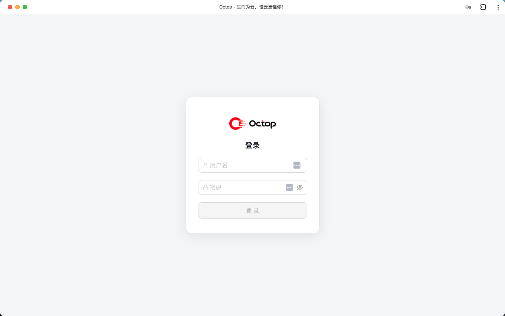

### 5.2 对话（Chat）

- 进入 **对话** 页面，选择当前 Agent 即可开始实时聊天。
- 支持多轮对话、附件上传、工具调用展示。
- 可在对话中通过斜杠命令（slash）触发特定能力。

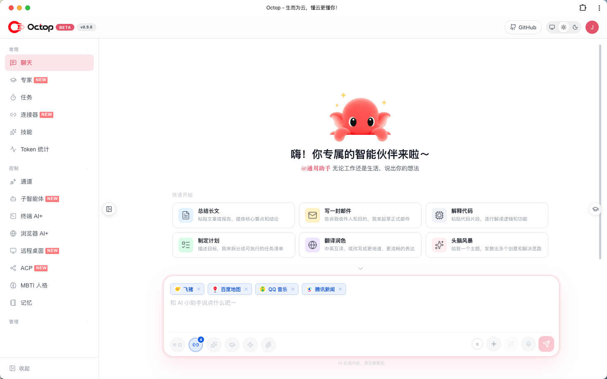

### 5.3 创建 Agent（专家库 / MBTI 人格）

- 进入 **Agent → 专家** 页面，从专家库模板中选择专业角色（如写作、编程、数据分析），一键创建。
- 选择 **MBTI 人格** 模板为 Agent 赋予性格（也可做人格测试自动生成）。
- 为该 Agent 指定 **供应商与模型**、工作区后端。

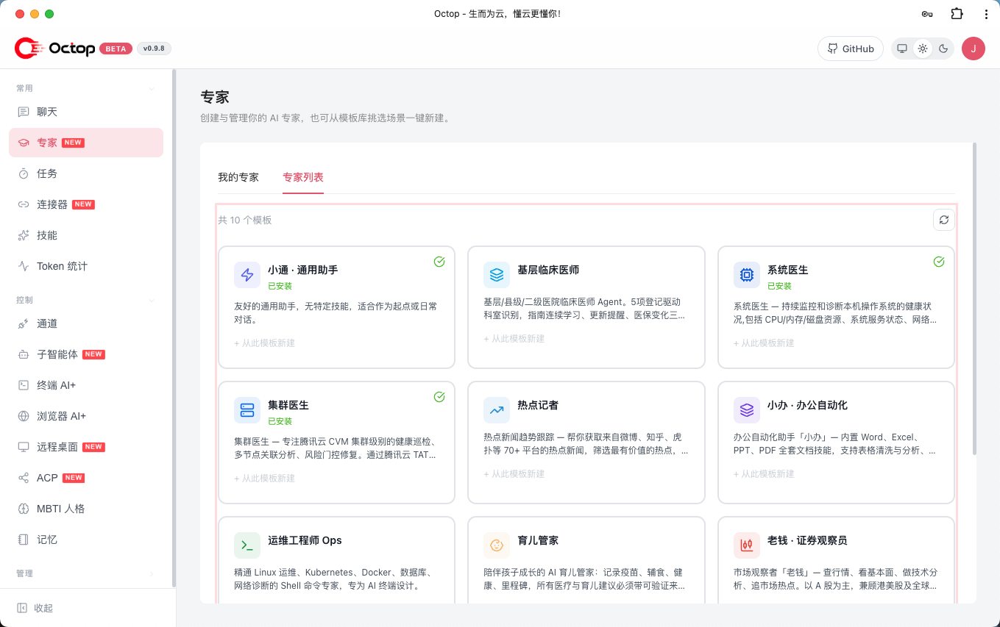

### 5.4 连接器（Connectors）

- 进入 **Connectors** 页面，配置 OAuth 应用与 MCP 网关。
- 通过连接器接入外部服务（如腾讯文档、微博、新闻等），扩展 Agent 的资源边界。

### 5.5 通道（Channels / IM）

- 进入 **通道** 页面，安装并配置 IM 平台：飞书、钉钉、QQ、Discord、企业微信等。
- 各通道所需凭证见下表：

| 通道 | 所需凭证 |
|------|----------|
| 飞书 | App ID、App Secret |
| 钉钉 | App Key、App Secret |
| QQ | Bot AppID、Token |
| Discord | Bot Token |
| 企业微信 | Corp ID、Agent Secret |
| Web 控制台 | 默认启用 |

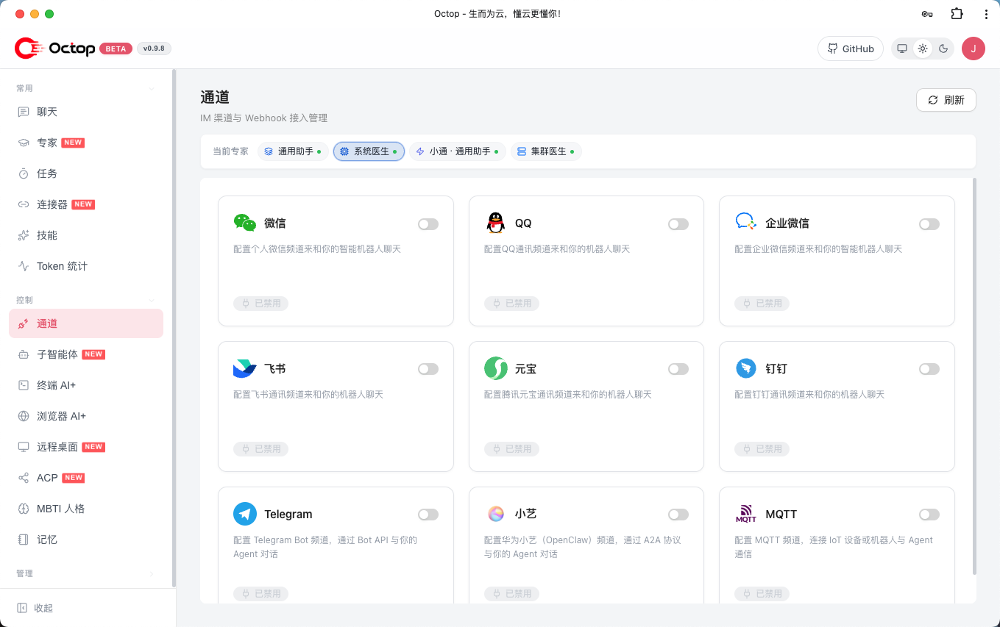

### 5.6 定时任务（Cron）

- 进入 **定时任务** 页面，可视化创建 Cron 任务。
- 支持自然语言或斜杠命令触发，让 Agent 按时推送或执行任务。

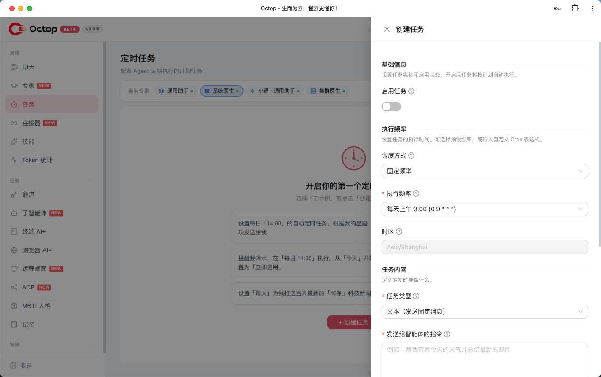

### 5.7 ACP（与 IDE / 编码 Agent 协作）

Octop 支持两个方向的 ACP 集成：

1. **入站** —— 让外部工具（Zed、OpenCode 等）使用你的 Octop Agent：

   ```bash
   octop acp --agent main
   ```

2. **出站** —— 在对话中把编码任务委派给外部 Agent（OpenCode、CodeBuddy、Claude Code、Codex）：
   - 控制台 → **ACP**：配置 Runner（按用户全局）。
   - 为 Agent 启用 `acp_runner`，然后在对话中委派。

完整配置见 [docs/acp.md](docs/acp.md)。

### 5.8 设置（用户 / 安全 / TLS / 系统）

- **用户**：管理账号、角色、修改密码。
- **安全**：工具审批、Shell 命令护栏（`~/.octop/security/tool_guard/`）。
- **TLS**：配置 HTTPS（自签或 Let's Encrypt）。
- **系统**：监听地址 / 端口、日志级别、定时任务时区等。

> 手动编辑配置文件：运行时参数保存在 `~/.octop/config.json`，可用环境变量覆盖（如 `OCTOP_PORT`、`OCTOP_BIND_HOST`）。详见 [docs/configuration.md](docs/configuration.md)。

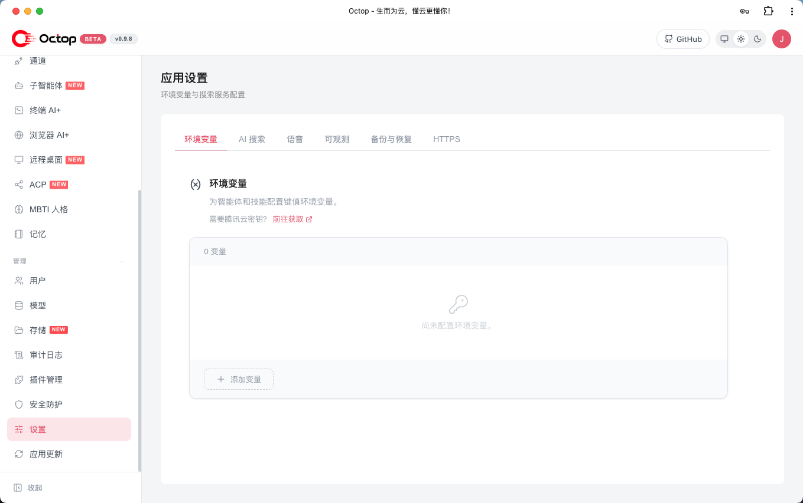

### 5.9 远程桌面与浏览器 AI

在 **控制台 → 控制（Control）** 页面中可使用：

- **远程桌面**：实时查看屏幕并控制键鼠，支持 Linux / Windows / macOS；无图形的 Linux 可一键创建隔离桌面，适合远程办公与 GUI 软件操作。

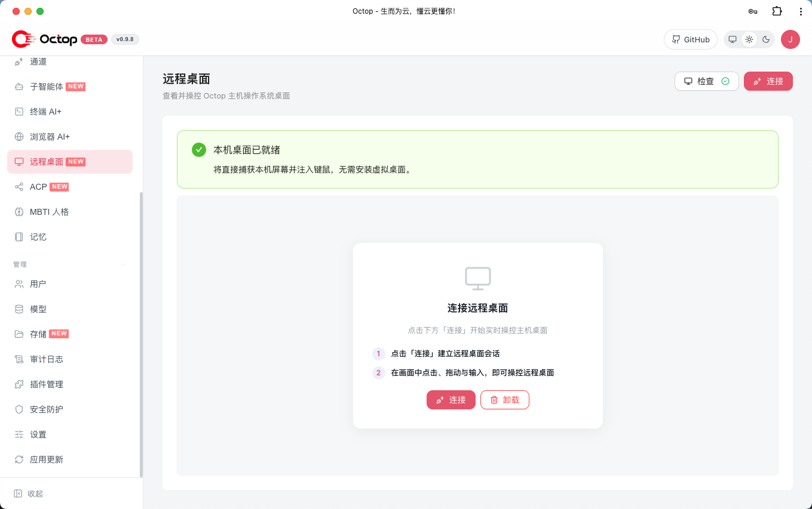

- **浏览器 AI+**：基于 Chromium 的无头会话，支持网页自动化、截图与远程浏览，内置 AI 助手与技能录制。

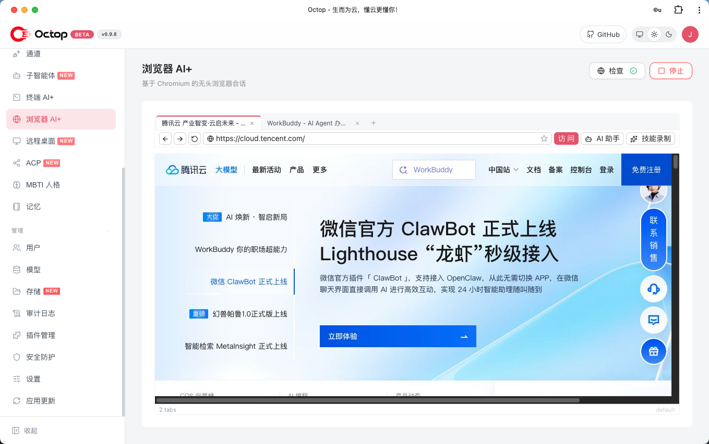

---

## 六、常用命令速查

| 命令 | 说明 |
|------|------|
| `octop run` | 前台启动 Octop |
| `octop run --host 0.0.0.0 --port 8088` | 自定义监听地址与端口 |
| `octop service start` | 安装并启动系统服务 |
| `octop service stop` | 停止系统服务 |
| `octop agent` | 创建、列出、启停 Agent |
| `octop channel` | 安装与管理 IM 通道 |
| `octop chats` | REPL 与会话管理 |
| `octop acp` | 为 IDE 提供 stdio ACP 服务 |
| `octop cron` | 管理定时任务 |
| `octop models` | 供应商预设与模型解析 |
| `octop provider list` | 列出已配置供应商 |
| `octop skills` | 按 Agent 启用 / 禁用 Skill |
| `octop user list` | 列出用户（管理员） |
| `octop backup` | 导出 / 恢复备份 |
| `octop update` | 检查并安装更新 |

完整参考见 [docs/cli.md](docs/cli.md)。

---

## 七、常见问题

**Q：访问 http://127.0.0.1:8088 打不开？**
- 确认已执行 `octop run` 且终端无报错。
- 若改过端口，请访问对应地址（如 `http://127.0.0.1:8088` 或自定义端口）。
- 用 `octop service status`（Linux / macOS）确认服务状态。

**Q：忘记管理员密码？**
- 可通过 CLI 重置或重新初始化（注意：重置密码请使用用户管理相关命令 / 直接管理数据库）。

**Q：模型测试连接失败？**
- 检查 API Key、Base URL 是否正确，网络是否可访问该服务，账户是否有配额。

**Q：如何修改监听地址让局域网访问？**
- 启动时：`octop run --host 0.0.0.0 --port 8088`；或设置环境变量 `OCTOP_BIND_HOST=0.0.0.0`、`OCTOP_PORT=8088`。

**Q：数据存放在哪里？**
- 全部在 `~/.octop/`：

```
~/.octop/
├── config.json              # 进程级配置（地址、端口、CORS、TLS、database …）
├── octop.db                 # 默认 SQLite 控制面 — 用户、Agent、通道、定时任务 …
├── secrets/                 # JWT 密钥、通道 Token
├── agents/<agent_id>/       # 各 Agent 工作区（SOUL.md、skills …）
├── security/tool_guard/     # Shell 命令允许 / 拒绝规则
├── logs/                    # 运行日志
└── bin/octop                # PATH 包装脚本 → venv/bin/octop
```

**Q：如何升级？**
- `octop update`（若通过一键安装）；或从 PyPI / 源码重新安装后重启服务。

**Q：如何加入客户企业微信服务群？**
- 请扫描下方二维码加入：


> 二维码有效期至 **2026-08-03**，过期后请联系管理员更新。

---

## 八、插图清单

文档中的插图汇总如下（已放置在 `docs/assets/` 目录）：

| 编号 | 位置 | 文件名 | 状态 | 内容说明 |
|------|------|--------|------|----------|
| 图 1.1 | 一、简介 | `overview.png` | ✅ 已就位 | Octop 品牌 Banner |
| 图 3.1 | 3.2 向导步骤 | `setup-01-steps.png` | ✅ 已就位 | 向导步骤条（验证密码页） |
| 图 3.2 | 3.2 管理员 | `setup-02-admin.png` | ✅ 已就位 | 创建管理员账号表单 |
| 图 3.3 | 3.2 模型 | `setup-03-model.png` | ✅ 已就位 | 向导内预设供应商选择 |
| 图 4.1 | 4.2 自定义 | `model-01-custom.png` | ✅ 已就位 | 自定义供应商弹窗 |
| 图 4.2 | 4.4 管理 | `model-02-manage.png` | ✅ 已就位 | 控制台模型管理页（预设/自定义供应商列表） |
| 图 5.1 | 5.1 登录 | `use-01-login.png` | ✅ 已就位 | 登录页面 |
| 图 5.2 | 5.2 对话 | `use-02-chat.png` | ✅ 已就位 | 对话主界面（Welcome + 快捷卡片） |
| 图 5.3 | 5.3 Agent | `use-03-agent.png` | ✅ 已就位 | 专家库模板列表 |
| 图 5.4 | 5.5 通道 | `use-04-channels.png` | ✅ 已就位 | IM 通道开关列表 |
| 图 5.5 | 5.6 Cron | `use-05-cron.png` | ✅ 已就位 | 创建定时任务弹窗 |
| 图 5.6 | 5.8 设置 | `use-06-settings.png` | ✅ 已就位 | 应用设置页面 |
| 图 5.7 | 5.9 远程桌面 | `use-07-remote-desktop.png` | ✅ 已就位 | 远程桌面连接页 |
| 图 5.8 | 5.9 浏览器 AI | `use-08-browser-ai.png` | ✅ 已就位 | 浏览器 AI+ 会话页 |
| 图 7.1 | 七、常见问题 | `qrcode.png` | ✅ 已就位 | 客户企业微信服务群二维码（有效期至 2026-08-03） |
